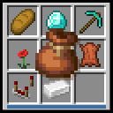

# Bundle Stash（探囊取物）



在容器界面（箱子、背包、熔炉……）侧边显示玩家背包里**所有收纳袋的内容**，
带分类、搜索与一键存取的客户端模组，支持 **Fabric / NeoForge × Minecraft 26.1–26.3**。

- 分类浏览：全部 / 方块 / 植物 / 食物 / 工具与装备 / 矿物 / 杂物，依据物品标签与属性自动归类，版本更新不会让分类表过期
- 搜索：物品名、注册 id、拼音（含首字母，pinyin4j 提供），按相关度排序
- 一键存取：点击取出到鼠标、Shift+点击取出到空格子、点击面板把鼠标上的物品存入
- 空格 + 点击/拖拽槽位：整堆收纳
- 悬停条目时在背包里高亮它所属的收纳袋
- 面板可换边（合成书打开时自动让开）、可调行数列数、可整体隐藏
- 界面视觉完全使用原版贴图与配色

仅客户端，不依赖 Fabric API / NeoForge 附加库。
Fabric 侧 modId 为 `bundle-stash`（`"environment": "client"`）；
NeoForge 侧 modId 为 `bundle_stash`（该加载器不允许连字符，`@Mod(dist = CLIENT)`），
资源命名空间 `assets/bundle-stash` 两侧通用，配置文件也共用 `config/bundle-stash.json`。

## 构建

要求 [JDK 25](https://adoptium.net/)（或更高）；Gradle 由 wrapper 自带，无需安装。

多版本 × 多加载器矩阵由 **Stonecutter**（源码预处理/版本切换）+ **Architectury Loom**
（`loom-no-remap` 变体，26.x 不混淆、无需重映射）驱动，共 6 个节点：

| 加载器 \ Minecraft | 26.1 | 26.2 | 26.3 |
| --- | --- | --- | --- |
| Fabric | `26.1-fabric` | `26.2-fabric` | `26.3-fabric` |
| NeoForge | `26.1-neoforge` | `26.2-neoforge` | `26.3-neoforge` |

```bash
./gradlew build              # 构建全部 6 个节点（Windows: gradlew.bat build）
./gradlew buildAndCollect    # 构建全部节点并汇总 jar 到 build/libs/<版本>/
./gradlew :26.3-fabric:build             # 只构建单个节点
./gradlew :26.3-neoforge:runClient       # 启动该节点的开发客户端试玩
```

切换当前编辑的节点（预处理根目录 `src/` 到目标节点状态）：

```bash
./gradlew "Set active project to 26.1-neoforge"   # 切到任意节点
./gradlew "Refresh active project"                # 重新按当前节点刷新注释状态
./gradlew "Reset active project"                  # 回到规范节点 26.3-fabric
```

也可以用 IDE 的 Stonecutter 运行配置下拉切换（`./gradlew stonecutterIdea` 生成）。

产物：

- `build/libs/<mod版本>+<mc>/bundle-stash-<loader>-<mod版本>+<mc>.jar` —— 发布用模组 jar（已内嵌 pinyin4j）
- 同目录 `-sources.jar` —— 源码包
- 单节点产物在 `versions/<节点>/build/libs/`

## 配置

首次运行后生成 `config/bundle-stash.json`，缺字段自动补默认值，改版本不会让旧配置失效。
也可通过面板角落的设置按钮直接改行数/列数。

## 代码结构

| 包 | 职责 |
| --- | --- |
| `bundlestash.core` | 纯逻辑：数据快照、布局几何、分类、搜索打分。**不 import 任何 Minecraft 类型** |
| `bundlestash.gui` | 绘制与交互编排：控制器、渲染器、设置弹窗。只依赖 `core` 与绘制接口 |
| `bundlestash.platform` | Minecraft 适配层：采集收纳袋快照、绘制原语、搜索框、发包 |
| `bundlestash.mixin` | 容器界面/键盘事件的注入点与 accessor |
| `bundlestash.config` | JSON 配置的读写与纠错 |

换 Minecraft 版本时，理论上只需改 `platform` 与 `mixin` 两层；
`core`/`gui` 的几何与规则可以原样复用。

### 多版本 / 多加载器约定

- **版本差异**用 Stonecutter 注释分支表达，条件写在共享源码里，例如
  `//? if >=26.3 { ... } //? else { ... }`（当前已用到的分界：取屏幕 26.2，
  空格键检测、鼠标键编号、输入法回调 `textEditing`/`preeditCallback` 改名与
  `BundleContents` 可变 API 均为 26.3）。
- **加载器差异**同理：`//? if fabric { ... } //? elif neoforge { ... }`。
  入口类 `BetterBundleMod` 同时承担 Fabric 的 `ClientModInitializer` 与
  NeoForge 的 `@Mod` 入口，初始化逻辑汇合到共用的 `init(Path)`。
- 每个节点的依赖在 `versions/<节点>/gradle.properties`（`loom.platform`、
  loader 版本），共享参数在根 `gradle.properties`。
- 元数据按加载器互斥打包：fabric 节点剔除 `META-INF/neoforge.mods.toml`，
  neoforge 节点剔除 `fabric.mod.json`（见 `build.gradle` 的 `processResources`）。

性能上的两条约定（改动时请保持）：

1. 快照每 100ms 最多重建一次，且先过 `McAccess.snapshotFingerprint()`——背包没动就整份跳过；
2. 显示名只在真正参与搜索打分时才解析（`PanelState.computeView` 的 `nameOf` 参数），
   快照里不保存，避免每 100ms 对每个条目跑一遍翻译。

## 更新日志

见 [CHANGELOG.md](CHANGELOG.md)（中英双语）。

## 许可

[MIT](LICENSE)
